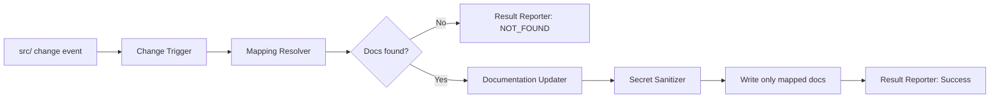

# Architecture

## Overview

The proposed POC uses a lightweight Node.js synchronization component that reacts to file changes under src/, resolves the relevant documentation files from a repository mapping configuration, updates only those documentation files, and returns NOT_FOUND when no mapping exists. The design keeps the solution small, uses the repository’s existing JavaScript toolchain, and avoids touching unrelated files or exposing repository secrets.

## Existing Repository Context

- The repository is already aligned with the Node.js/npm ecosystem, with package-level scripts at the root and backend/frontend packages.
- The project does not currently include a documentation sync service, so the simplest fit is a repository-local script or npm task rather than a new framework or separate service.
- The existing stack is JavaScript-first, so a native Node implementation using the file system APIs is the most practical choice for a POC.
- The architecture intentionally stays outside the application runtime logic and does not require a database, an external API, or a new framework.

## Components

### 1. Change Trigger

- Responsibility: Detect when files under src/ are added, modified, or deleted.
- Inputs: repository events from a file watcher, a Git-based diff step, or an explicit change manifest from a CI job.
- Outputs: a normalized list of changed source paths.
- Dependencies: repository file system and the src/ path constraint.

### 2. Documentation Mapping Resolver

- Responsibility: Read the repository documentation mapping configuration and determine which documentation files correspond to each changed source file.
- Inputs: changed source paths and the mapping configuration.
- Outputs: associated documentation paths, or an empty result when no documentation is mapped.
- Dependencies: repository configuration file(s) that define source-to-documentation relationships.

### 3. Documentation Updater

- Responsibility: Update only the documentation files associated with the changed source files.
- Inputs: mapped documentation file paths and the changed source metadata.
- Outputs: updated documentation content for the mapped files only.
- Dependencies: file system write access and the repository’s documentation format conventions.

### 4. Secret Sanitizer

- Responsibility: Strip or mask repository secrets before generating or writing documentation output.
- Inputs: generated documentation content and repository secret metadata or known secret patterns.
- Outputs: sanitized content that does not expose tokens, passwords, keys, or other sensitive values.
- Dependencies: repository secret knowledge and content-generation rules.

### 5. Result Reporter

- Responsibility: Return a clear success or NOT_FOUND result without failing the repository build when no mapping exists.
- Inputs: update result, mapping result, and any errors raised during processing.
- Outputs: success status, NOT_FOUND status, or a non-blocking error message.
- Dependencies: command or hook exit behavior used by the repository.

## Data Flow

1. A source file under src/ is added, modified, or deleted.
2. The Change Trigger normalizes the event into a list of changed paths.
3. The Documentation Mapping Resolver loads the mapping configuration and matches the changed files to their associated documentation files.
4. If no documentation is associated, the Result Reporter returns NOT_FOUND and exits without failing the repository build.
5. If matches exist, the Documentation Updater prepares only the mapped documentation files for update.
6. The Secret Sanitizer filters generated content before writing it.
7. Only the mapped documentation files are written, leaving all unrelated documentation unchanged.
8. The Result Reporter returns success and logs the synchronization outcome.

## Architecture Diagram

## Technology Decisions

- Node.js is the appropriate runtime choice because the repository is already JavaScript-based and the sync logic is repository-local, lightweight, and file-oriented.
- Native Node file-system APIs are preferred over additional libraries because the POC does not require a broad framework or a remote service.
- A simple repository mapping config is used to declare source-to-documentation relationships. This is the least complex mechanism that satisfies FR-002 and FR-003 while keeping the design explicit and auditable.
- No database, queue, or application backend change is needed for this POC, because the trigger and update logic can be executed as a local script or repository hook.

## Error Handling

- When the mapping configuration yields no associated documentation, the architecture reports NOT_FOUND and completes without failing the repository build.
- When a mapped documentation file cannot be updated, the component reports the failure without broad repository rollback behavior.
- The architecture updates only the relevant documentation set, so unrelated docs remain stable and no-wide-scope failures are introduced.

## Security Considerations

- Generated documentation must not include repository secrets, credentials, or tokens.
- Secret filtering occurs before documentation is written, so the sync process remains safe even if source files or generated content contain sensitive values.
- The scope is limited to src/ and the mapped documentation files only, which reduces the risk of accidental exposure or modification outside the required documentation set.

## Requirement Coverage

| Requirement | Coverage |
| --- | --- |
| FR-001: Trigger on src/ add/modify/delete | Covered by Change Trigger and the repository-local event path |
| FR-002: Identify mapped documentation using config | Covered by Documentation Mapping Resolver |
| FR-003: Update only mapped documentation | Covered by Documentation Updater and path scoping |
| FR-004: Report NOT_FOUND and do not fail build | Covered by Result Reporter and error handling |
| FR-005: Generated docs must not contain secrets | Covered by Secret Sanitizer |
| FR-006: Unrelated docs remain unchanged | Covered by scoped updates and path filtering |
| Dependencies and constraints | Covered by repo-local Node architecture and explicit mapping configuration |

## Assumptions and Limitations

- The repository provides a documentation mapping configuration in a format maintained by the project.
- The synchronization process is scoped to source files under src/ and does not include non-source paths.
- This is a POC architecture and does not introduce unrelated repository automation beyond the required sync behavior.
