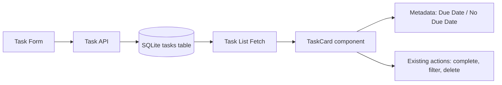

# Architecture
## Inputs and Constraints
- Approved requirement source: Jira KAN-116, "Display existing due date on task cards".
- Scope is a frontend-only enhancement with no backend API or database schema changes.
- The task model already includes a persisted due_date field in the SQLite schema and API payload flow.
- No new dependencies or unrelated behavior changes are allowed.
- Existing task workflows must remain intact: create, edit, complete, filter, and delete.

## Proposed Approach
Use the existing task data contract and render the due date within the task card metadata region, reusing the task.due_date field that is already available in the backend and UI models. When the field is absent, render a neutral string instead of leaving the metadata blank. Keep the change localized to the presentation layer and rely on the current fetch/update flow rather than introducing new API endpoints or schema changes.

## Components and Responsibilities
- Task form: collects due_date input on task creation and sends it through the existing API payload contract.
- Backend task API: reads and persists due_date via the existing SQLite tasks table; no schema extension is required.
- Task list and task cards: render the task metadata, including the due date badge/label and neutral fallback.
- Existing filters and task actions: continue to operate on the same task objects and do not depend on the due date display.

## Data Flow
1. The user creates or edits a task through the frontend form.
2. The form submits due_date as part of the normal task payload to the existing API.
3. The backend stores due_date in the tasks table without changing the schema contract.
4. The frontend fetches tasks and passes each task into the card component.
5. The card component formats and renders the due date when present and a neutral fallback when absent.
6. Existing complete, search, filter, and delete interactions continue to operate on the same task objects without additional state changes.

## Requirement Traceability
- FR-001 / AC-001: Task cards display existing due date when available -> task card metadata rendering layer.
- FR-002 / AC-002: Date is readable and user-friendly -> date formatting utility in the card component.
- FR-003 / AC-003: No-due-date tasks display "No Due Date" -> conditional rendering in task metadata area.
- FR-004 / AC-004: Visual consistency with task card metadata -> re-use existing badge/metadata styling patterns.
- FR-005 / AC-005: Existing task actions continue to work -> unchanged task list and API interactions.
- FR-006 / AC-006: Automated tests for due date display and fallback -> frontend/unit/e2e test coverage around task card rendering and task flow.
- NFR-001 to NFR-003: Frontend-only, due_date reuse, no new dependencies -> current architecture preserves the existing contract and avoids dependency additions.

## Error Handling and Relevant Security
- Missing due_date: handled as a controlled fallback path; no error thrown and no invalid API assumptions.
- Invalid date strings: handled gracefully by the formatting layer to avoid rendering crash or malformed output.
- API and storage: no new endpoints or permissions are introduced; the existing task API remains the single data path.
- Security impact: low; no new sensitive data or user inputs beyond the existing task fields are introduced.

## Dependencies and Trade-offs
- Dependency choice: reuse the existing due_date field and metadata UI so the change stays minimal and consistent with the repository's current architecture.
- Trade-off: this keeps the implementation narrow and low-risk, but it relies on the current task model already exposing due_date. If that field were missing, the requirement would require clarification before proceeding.
- No additional libraries or heavier state management are necessary; this remains a small UI enhancement in the current React component tree.

## Diagram

